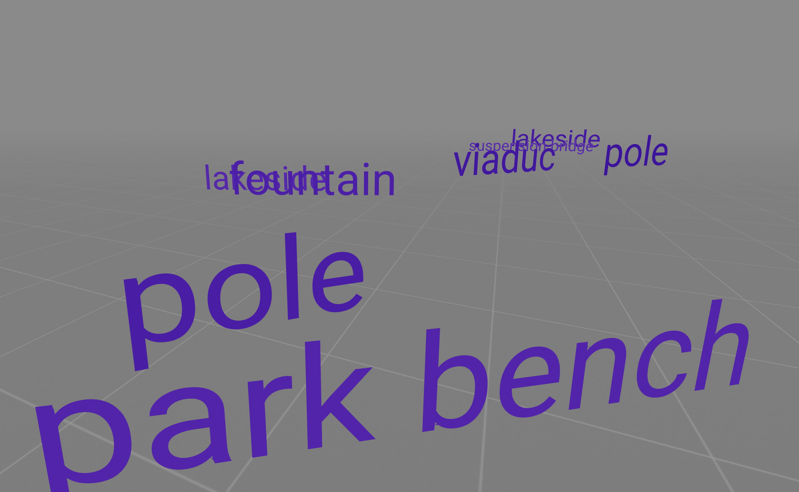

# CSAR Workshop

Gaëtan Robillard, Computational Semiotics Lab, 2026.


*csar workshop exemple 1*

This repository holds the in-class workshop materials for building a **first-person, browser-based visualization of machine-vision classification data**, using [A-Frame](https://aframe.io) and a CSV log collected from a live, on-device object classifier (MobileNetV4, running in-browser via ONNX/WebGPU) walked through the Oval at OSU.

The exercise sits inside a larger research question: machine vision systems impose a fixed, categorical vocabulary onto whatever they see, and that vocabulary rarely matches the place it's describing. Rather than reading that mismatch as a table of numbers, the workshop reprojects the classifier's own output — its words, and how confident it was in each one — back into a walkable 3D space, so the gap between what the model says and what is actually there becomes something you move through rather than something you read about.

No prior 3D, WebXR, or web development experience is assumed beyond the p5.js fundamentals (functions, data, basic OOP) covered earlier in the course.

## Repository structure

```
csar-workshop/
├── data/
│   ├── live-detection_<timestamp>_raw.csv          # raw export from the live classifier: every
│   │                                                #   prediction (top-3 ranks), GPS, bounding
│   │                                                #   boxes, and timing metadata for each frame
│   ├── clean.py                                     # turns a raw log into a small, ready-to-use CSV
│   ├── casr-oval-park-workshop.csv                   # top-rank predictions only, lat/lon kept as-is
│   ├── csar-oval-park-workshop-metric.csv            # lat/lon converted to local x/z meters
│   └── csar-oval-park-workshop-metric-noduplicates.csv   # metric + duplicate rows removed —
│                                                          #   the dataset actually used in exemple-2
├── exemple-1/
│   ├── index.html
│   └── script.js       # baseline: data typed directly into the script as an array of objects
└── exemple-2/
    ├── index.html
    ├── script.js        # loads points from an external CSV; adds random position and rotation
    ├── data.csv          # small hand-written sample (8 points), loaded by default
    └── data-csar-oval.csv   # the real, cleaned Oval Park dataset — swap this in for real data
```

## The two examples

The two folders are meant to be worked through in order, each adding one idea to the last — the same progression as the workshop itself:

**`exemple-1`** — the data lives directly in the script as an array of objects, the same shape used in the p5.js OOP unit. This is the version to read first: one function turns a single data point into a visible label, and a loop calls it once per point. No file I/O, no randomness — just the core pattern.

**`exemple-2`** — the array is replaced with a `fetch()` of an external CSV (same pattern as `loadTable()` in p5.js), and each label gets a small random position offset and rotation so the field doesn't read as a rigid grid. It ships with a tiny placeholder `data.csv`; swapping in `data-csar-oval.csv` (rename it to `data.csv`, or edit the `fetch()` path in `script.js`) replaces the placeholder points with the real, cleaned Oval Park walk.

## Running a scene

Both examples are plain static files — no build step. `fetch()` of the CSV only works when the page is served over `http`, so **double-clicking `index.html` will not work**. Easiest options:

- Open the files in [p5 web editor](https://editor.p5js.org/)
- Or serve it locally: `python3 -m http.server` from inside the folder, then visit `http://localhost:8000`.

Controls in-scene: drag to look around, WASD to move.

## The data pipeline

`data/clean.py` takes the raw classifier export and produces the file the A-Frame scenes actually read. It does three things, each switchable at the top of the script:

- **Keeps only the top-ranked prediction per frame** — the raw log records the classifier's top 3 guesses for every frame; the cleaning step drops ranks 2 and 3, keeping only what the model was most confident about.
- **Removes duplicate points** (`REMOVE_LATLON_DUPLICATES`) — consecutive frames at (near-)identical GPS coordinates collapse to a single row per unique (lat, lon, label) combination, so a person standing still doesn't produce dozens of stacked labels.
- **Converts GPS to local meters** (`USE_LOCAL_XZ`) — latitude/longitude aren't usable as A-Frame world coordinates directly; this reprojects them to flat x/z offsets in meters from the first recorded point, using a flat-earth approximation that's accurate enough at the scale of a short walk.

It also strips commas out of label text (some raw labels come back as `"maze, labyrinth"`), since a comma inside a field would otherwise be mistaken for a column separator once quoting is turned off.
